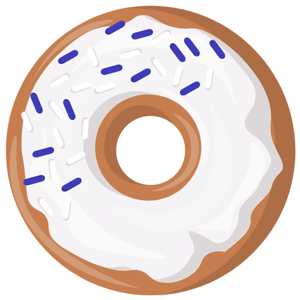
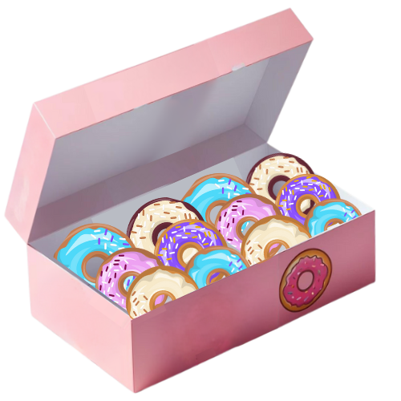
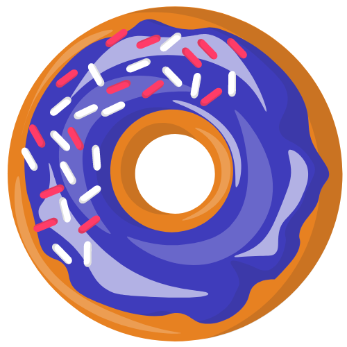

# Opensource Dashboard Frontend

Welcome to Opensource Dashboard, a.k.a. [Donut Dashboard](https://donutdashboard.netlify.app/), where devs receive virtually sweet rewards  for contributions to opensource projects. 

This frontend is built with React, styled with Tailwind CSS, and designed to interact with a [Django backend](https://github.com/Open-Source-Dashboard/OSD-backend) utilizing PostgreSQL.

### Authors
- [Tammy T. Do](https://github.com/tammytdo)
- [Andrea Riley(Thiel)](https://github.com/ariley215)
- [Lana Zumbrunn](https://github.com/lana-z)

## Features
- **GitHub Integration**: Donut Dashboard is a GitHub App using GitHub authorization and GitHub API repo data.        
- **User Information**: Opensource project stats including commit history of opensource contributions visualized by donuts.
- **Project Exploration**: Browse the top active opensource projects pulled from GitHub. Repos with the Topic tag 'Opensource' are considered.
- **Feedback**: Users can submit their feedback directly through the web app.


## Links and Resources

- Deployed site: [donutdashboard.netlify.app](https://donutdashboard.netlify.app/)
- Backend repo: [github.com/Open-Source-Dashboard/OSD-backend](https://github.com/Open-Source-Dashboard/OSD-backend)
- Deployed server: [osd-backend-td.vercel.app](https://osd-backend-td.vercel.app/)

## Change Log
- April 12 - May 18, 2024: Project planning and initial build.
- May 20 - 24, 2024: Styling, logic finishing touches, features glow up, deployment.
- May 27 - June 7, 2024: A/B testing on UI/UX.
- June - August, 2024: Bug fixes and UI/UX tweaks, testing, and final touches.


## Acknowledgments 
- GitHub  for APIs.
- Opensource project maintainers for sharing their projects, expertise and opportunities for contribution.
- OpenAI for ChatGPT code assistance and DALLE donut box art.
- [Github Readme Activity Graph](https://github.com/Ashutosh00710/github-readme-activity-graph/tree/main) by Ashutosh Dwivedi
- Figma for whiteboarding, domain modeling, UI, software requirements.
- Canva for creation of donut assets.  
- [EmailJS](https://www.emailjs.com/) for handling feedback submissions.
- Allison Do, Nicole Do for UI ideation and feedback.
- All of the amazing devs contributing to Opensource projects!


## Contributing
Interested in contributing? Here's how to get started: 

1. Clone the repository
2. Navigate to the project directory
3. Install dependencies:
`npm install`
4. Build the project:
`npm run build` 
5. Launch the development server:
`npm start`

```
npm install
npm run build
npm start
```

Access the application at http://localhost:3000.


### Project Contributors 

See your name here when we merge your PR!

Thank you!  
- Caleb Hemphill
- 