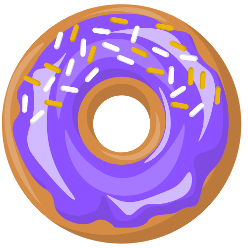

# Opensource Dashboard Frontend

Welcome to OpenSource Dashboard, where devs receive virtually sweet rewards  for contributions to opensource projects. 

Built with React App & Python Django styled with Tailwind CSS, and utilizing PostgreSQL.

### Authors
- [Tammy T. Do](https://github.com/tammytdo)
- [Andrea Riley(Thiel)](https://github.com/ariley215)
- [Lana Zumbrunn](https://github.com/lana-z)

## Features
- **GitHub App**: Opensource Dashboard is a GitHub App using GitHub Authorization and GitHub API repo data.        
- **User Information**: Opensource project stats including contributions represented by donuts and commit history.
- **Project Exploration**: Browse the top active opensource projects pulled from GitHub. Repos with the Topic tag 'Opensource' are considered.
- **Feedback**: Users can submit their feedback directly at the web app.

## Links and Resources

- frontend application link, project TBD - to be deployed!
- [backend server url](https://osd-backend.vercel.app/)

## Change Log
- April 12 - May 18, 2024 - started project planning, initial build
- May 20 - 24 - styling, logic finishing touches, features glow up, deployment
- May 27 - June 7 - A/B testing on UI/UX

## Acknowledgments 
- GitHub 
- Opensource project maintainers for sharing their projects, expertise and opportunities for contribution
- OpenAI for ChatGPT code assistance and DALLE donut box art
- [Github Readme Activity Graph](https://github.com/Ashutosh00710/github-readme-activity-graph/tree/main) by Ashutosh Dwivedi
- Figma for whiteboarding, domain modeling, UI, software requirements
- Canva for creation of donut assets  
- [EmailJS](https://www.emailjs.com/) for feedback emails
- Allison Do, Nicole Do for UI ideation and feedback
- All of the amazing devs contributing to Opensource projects!

## Want to contribute to our project? 
To get a local copy up and running, follow these steps:

1. Clone the repository
2. Navigate to the project directory
3. Install dependencies:
`npm install`
4. Build the project:
`npm run build`
5. Launch the development server:
`npm start`

The application should now be running on http://localhost:3000.

### Project Contributors 

See your name here when we merge your PR!

Thank you!  
- Caleb Hemphill